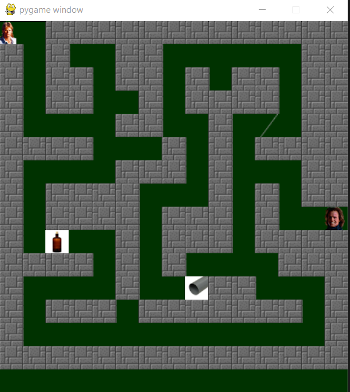

<h1>About the project 
Project 3 - Maze - Help MacGyver</h1> 
Help MacGyver get out of the maze by collecting items to confront the Guardian.

<h2><b>Built with</b></h2>
Python version 3.8.2 
Pygame version 2.0.0 
Visual Studio Code 1.47.3

<h2><b>Game controls</b></h2>
Use arrow keys to move MacGyver.

<h2><b>Contributing</b></h2>
Maze on GitHub 
<a href="https://github.com/MaryOC2577/Projet-3.git">https://github.com/MaryOC2577/Projet-3.git</a>

<h2></b>Contact</b></h2>
Maryline 
<a href="marybot@free.fr">marybot@free.fr</a>
