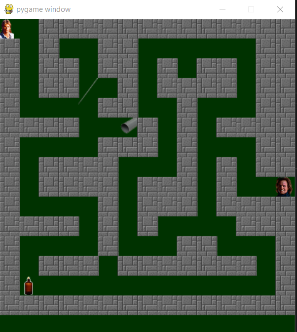

<h1>Project 3 - Maze - Help MacGyver</h1>
Help MacGyver get out of the maze by collecting items to confront the Guardian.

<u><b>Maze on GitHub</b></u> 
<a href="https://github.com/MaryOC2577/Projet-3.git">https://github.com/MaryOC2577/Projet-3.git</a>

<u><b>Game controls</b></u> 
Use arrow keys to move MacGyver.

<u><b>Python version 3.8.2</b></u>

<u><b>Pygame version 1.9.6</b></u>

<u><b>Visual Studio Code 1.47.3</b></u>

<u><b>Contact author</b></u> 
Maryline 
<a href="marybot@free.fr">marybot@free.fr</a>
